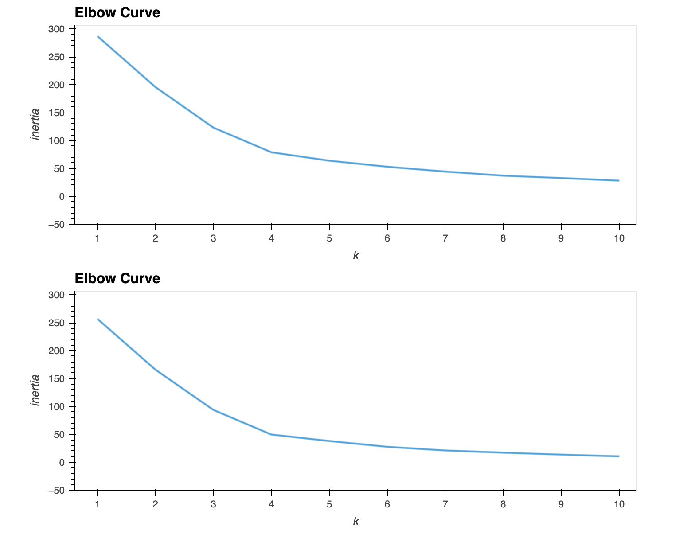
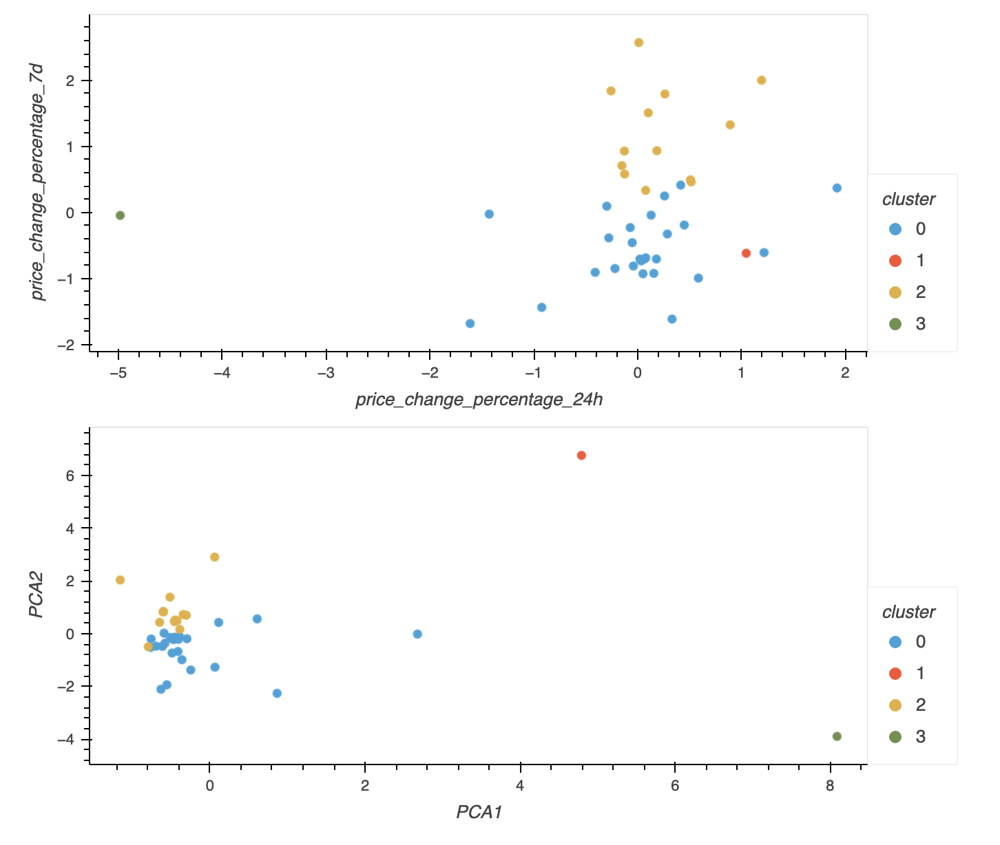

# CryptoClustering

## Background

The aim of this project was to explore unsupervised machine learning to predict price changes in cryptocurrencies.

## Methods

The data on price changes of cryptocurrencies within different time periods (spanning from 24 hours to one year) were loaded from a CSV file into a DataFrame in the Jupyter Notebook (`Crypto_Clustering.ipynb`). 

We took a quick glance at the data by plotting them on a line graph without fitting a model or accounting for cluster predictions. The data were scaled or normalized using the StandardScaler() module from the scikit-learn library. Once scaled, the data were ready for finding the best value for k (number of clusters).

The optimal value for k was determined by two methods. First, an Elbow Curve was generated--the value of clusters ("k") as the x-axis and the sum of the squared distances of data points to their closest cluster center (inertia) as the y-axis. The optimal k value was obtained from the point at which the graph formed an elbow. With this value of k, the K-means model was initialized to predict clusters within cryptocurrencies. The predicted clusters were then visualized with colors on a scatter plot. 

The other method we used to predict clusters was Princiapl Component Analysis (PCA). PCA is a dimentionality reduction technique that lowers the number of input features while retaining as much of the original information as possible. In this particular analysis, we reduced the features to 3 principal components. We fit the PCA data into the K-means model and examined their clustering pattern in a scatter plot.

## Results
Both keeping the data without PCA and transforming them with PCA suggested 4 as the best k value (number of clusters) for the cryptocurrency portfolio. However, PCA improved the clustering, meaning there were more prominent clusters when fewer features were used compared to the original data.

